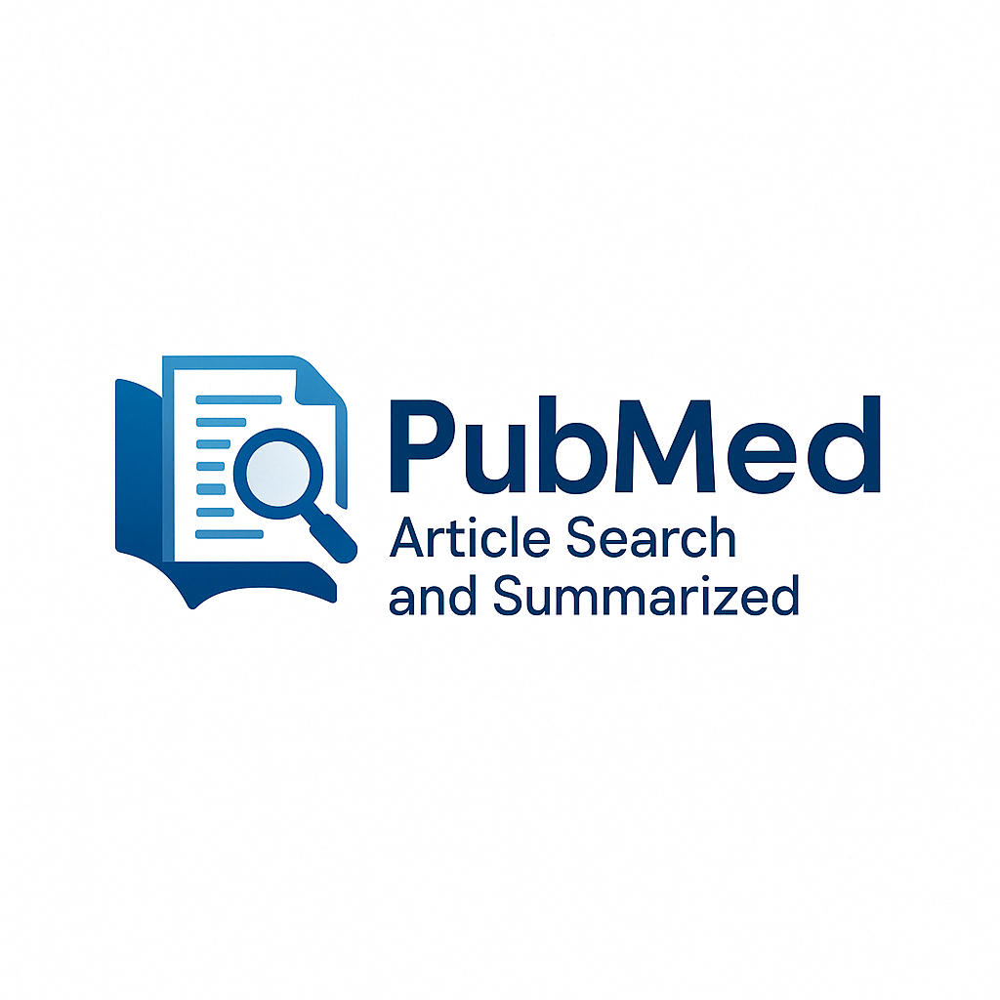

# PubMedSearch - PubMed Research Assistant


<br>

## Overview

MedSearch is an advanced PubMed research assistant that helps medical professionals and researchers quickly find, summarize, and analyze relevant medical literature. Built with Streamlit and powered by OpenAI's language models, MedSearch streamlines the literature review process by providing AI-enhanced article summaries, cross-article analysis, and interactive question answering capabilities.

## Features

- **Advanced PubMed Search**: Search by keywords, disease, author, journal, and date range
- **AI-Powered Summaries**: Get concise summaries of each research article abstract
- **Cross-Article Analysis**: Automatically identify key findings, research gaps, and clinical recommendations
- **Interactive Q&A**: Ask questions about the retrieved articles and get informed answers
- **Export Options**: Generate reports or export citations in various formats (Markdown, BibTeX, CSV)
- **Publication Timeline**: Visualize the temporal distribution of research articles
- **Search History**: Easily access and reuse previous search queries

## Installation

1. Clone this repository:
   ```bash
   git clone https://github.com/yourusername/medsearch.git
   cd pubmedsearch
   ```

2. Install the required packages:
   ```bash
   pip install -r requirements.txt
   ```

3. Create a `.env` file in the project root directory with your OpenAI API key:
   ```
   OPENAI_API_KEY=your_openai_api_key_here
   ```

## Usage

Run the Streamlit app:
```bash
streamlit run app.py
```

Then open your browser and go to `http://localhost:8501` to use the application.

### Search PubMed

1. Enter keywords and/or a disease/condition in the sidebar
2. Optionally, configure advanced filters:
   - Search logic (AND/OR)
   - Publication date range
   - Author name
   - Journal name
   - Maximum results to retrieve
3. Click "Search PubMed" to submit your query

### Explore Results

After searching, you can:
- View article details including abstracts and AI-generated summaries
- See key findings across all articles
- Identify research gaps and clinical recommendations
- Ask questions about the articles
- Export search results in various formats

## Example Use Cases

- **Systematic Reviews**: Accelerate the initial phase of systematic reviews by quickly identifying and summarizing relevant literature
- **Clinical Decision Support**: Find evidence-based recommendations for specific patient conditions
- **Medical Education**: Help students and residents efficiently review literature on specific topics
- **Research Planning**: Identify research gaps to inform study design and grant proposals
- **Patient Case Research**: Quickly find relevant studies for challenging patient cases

## Deployment to Streamlit Cloud

This application can be deployed to [Streamlit Cloud]([https://streamlit.io/cloud](https://noor-pubmed-summarizer.streamlit.app/)). When deploying:

1. Add your OpenAI API key to Streamlit secrets instead of using the .env file
2. No additional configuration is needed, as the code handles both local and cloud deployment environments

## Requirements

See [requirements.txt](requirements.txt) for the full list of dependencies.

Main requirements:
- Python 3.7+
- Streamlit
- OpenAI API
- Beautiful Soup
- Pandas

## Contributing

Contributions are welcome! Please feel free to submit a Pull Request.

## License

This project is licensed under the MIT License - see the LICENSE file for details.

## Acknowledgments

- PubMed API for providing access to medical research articles
- OpenAI for providing the language models used for article analysis
- Streamlit for the interactive web application framework
